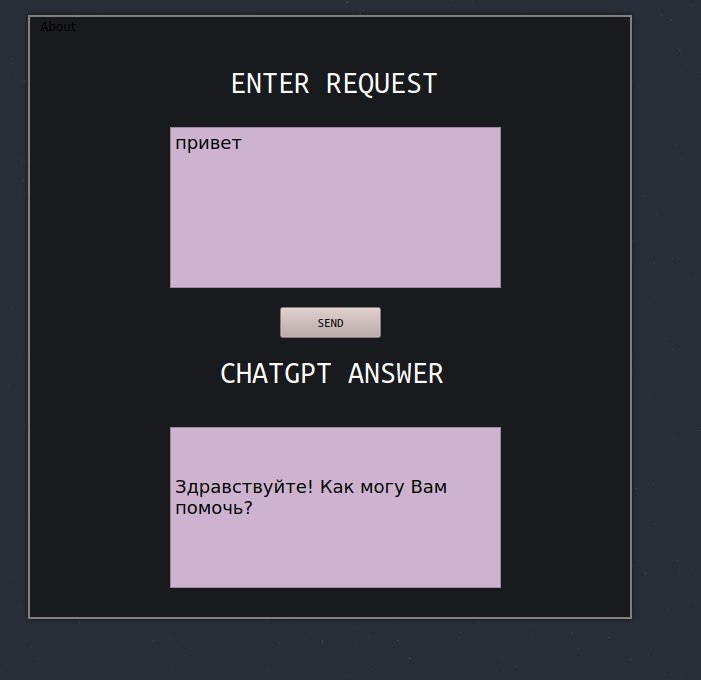

## :bone: Introduction
__OpenGPT is a free and open source project that uses the openai API to work.__

__:ballot_box_with_check: Advantages:__
- Modern ui.
- Performance thanks to c++.  
- Long maintainability.  
- open source.

## __:framed_picture: Screenshots:__

</img>

## __:file_folder:Installing:__
- for arch linux users install with aur (yay): 
`yay -S open-gpt-bin`

There is a binary application for arch linux in aur: <link>, you can use yay to install it: `yay -S open-gpt-bin`.
